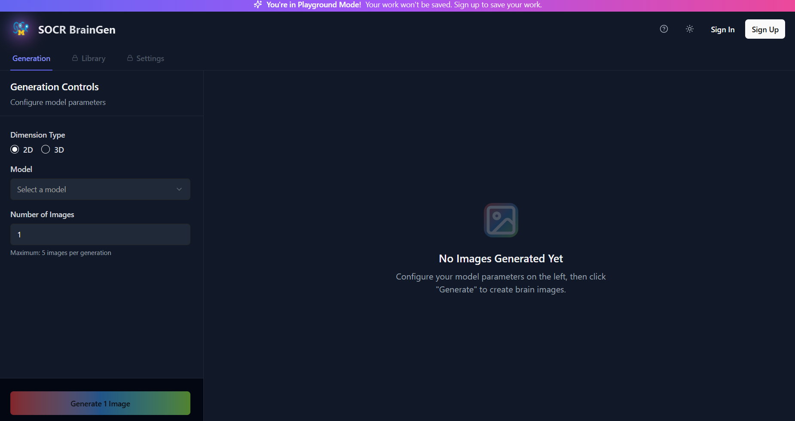
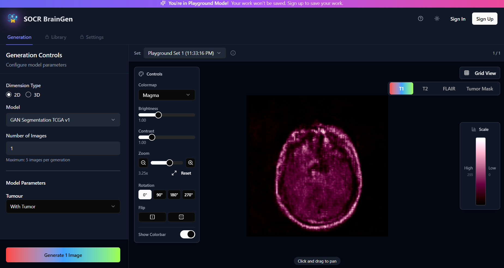
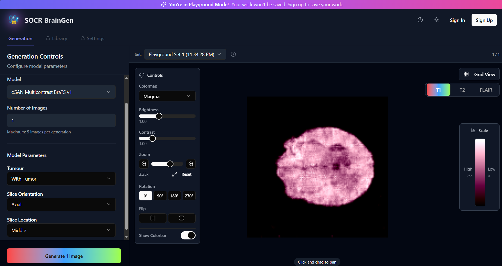
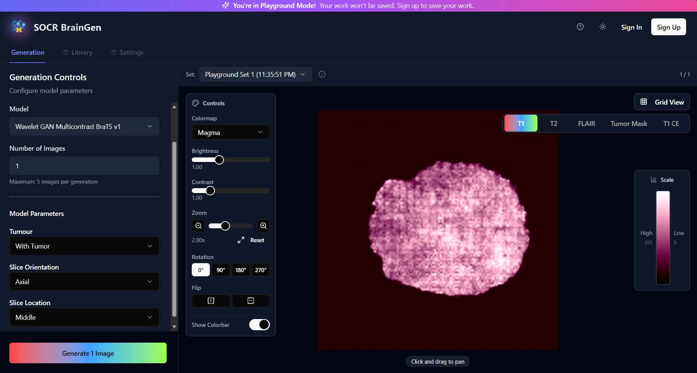
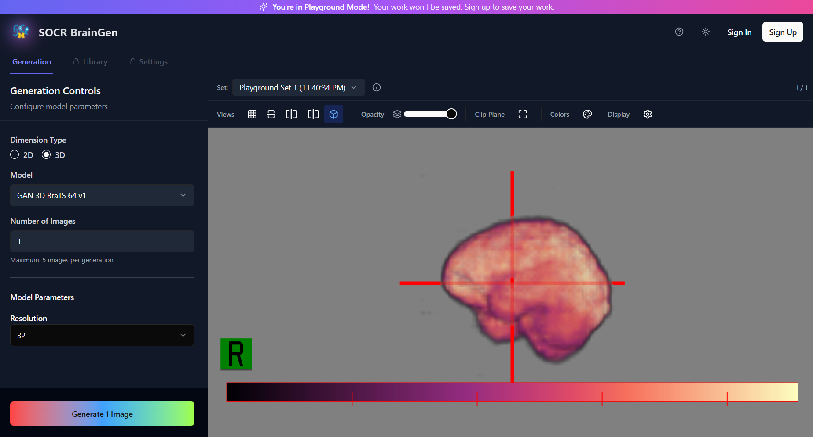
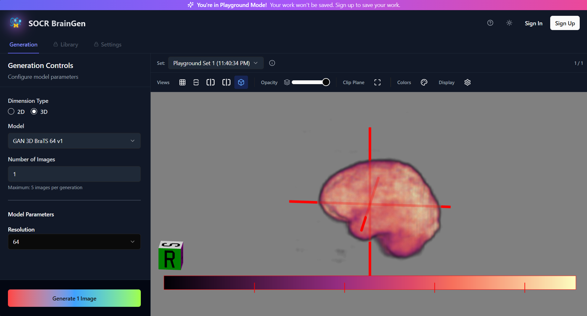

# [Synthetic 2D and 3D Brain MRI Generation with Conditional GANs, Wavelet-Domain GANs, and Diffusion Models](https://brain-image-generator.vercel.app)

[](https://brain-image-generator.vercel.app)
[](https://socr.umich.edu/html/SOCR_CitingLicense.html)
[](https://socr.umich.edu)



The **SOCR AI Bot** is an open-source suite of trained deep generative models for synthetic brain MRI, together with pre-generated image samples, validation metrics, and an interactive web application. Developed by the [Statistics Online Computational Resource (SOCR)](https://socr.umich.edu) at the University of Michigan, the project addresses a core challenge in neuroimaging research: access to large quantities of realistic brain MRI data is constrained by acquisition cost, scanning time, and patient privacy regulations. The released models produce synthetic images whose statistics approximate those of the training distribution without corresponding to any individual patient record.

The suite includes conditional deep convolutional GANs trained on the TCGA brain MRI collection (3,929 axial slices) and on the BraTS dataset (50,759 slices from 369 multi-contrast volumes), a wavelet-domain GAN for multi-contrast T1, T1ce, T2, and FLAIR generation with paired segmentation masks, a denoising diffusion implicit model (DDIM), and two 3D conditional GANs producing volumes at 32³ and 64³ voxel resolutions. Conditioning variables include tumour presence, slice orientation, and anatomical location, yielding 18 distinct conditional classes for the BraTS-based models.

Users can generate up to 5 images per session, inspect outputs with interactive controls including zoom, rotation, flip, colormap selection, and clip plane adjustment, and switch between multi-contrast modality views including T1, T2, FLAIR, Tumour Mask, and T1-CE — all directly in the browser without installing local software.

---

## Table of Contents

- [Live Demo](#live-demo)
- [Current Status](#current-status)
- [Features](#features)
- [Models](#models)
  - [braingen\_GAN\_TCGA\_v1](#1-braingen_gan_tcga_v1)
  - [braingen\_cGAN\_BraTS\_v1](#2-braingen_cgan_brats_v1)
  - [braingen\_WaveletGAN\_v1](#3-braingen_waveletgan_v1)
  - [braingen\_Diffuser\_v1](#4-braingen_diffuser_v1)
  - [braingen\_gan3d\_BraTS\_32\_v1](#5-braingen_gan3d_brats_32_v1)
  - [braingen\_gan3d\_BraTS\_64\_v1](#6-braingen_gan3d_brats_64_v1)
- [Training Configuration](#training-configuration)
- [Quantitative Evaluation](#quantitative-evaluation)
- [Datasets](#datasets)
- [Repository Structure](#repository-structure)
- [Getting Started](#getting-started)
- [Model Weights](#model-weights)
- [Recommended Applications](#recommended-applications)
- [Limitations](#limitations)
- [Disclaimer](#disclaimer)
- [References](#references)
- [Team](#team)

---

## Live Demo

**[https://brain-image-generator.vercel.app](https://brain-image-generator.vercel.app)**

No installation is required. Open the link, select a model, configure the available parameters, and click **Generate**. Playground Mode is available without signing up. Users may sign up to save generated image sets to a personal Library.

---

## Current Status

This repository is actively being updated in support of the associated manuscript:

> Achu Shankar, Ryan Kwon, Yueyang Shen, Alex Liu, Simeone Marino, and Ivo D. Dinov. *Synthetic 2D and 3D brain MRI generation with conditional GANs, wavelet-domain GANs, and diffusion models.* Statistics Online Computational Resource (SOCR), University of Michigan, 2025. (Manuscript in preparation — DOI and venue to be added at publication.)

---

## Features

- **2D and 3D generation** — Switch between 2D slice generation and full 3D volumetric synthesis
- **Multiple model architectures** — Six trained generative models spanning conditional DCGAN, Wavelet-domain GAN, DDIM Diffusion, and 3D cDCGAN paradigms
- **18 conditional classes** — BraTS-based models condition on tumour presence × slice orientation (axial/sagittal/coronal) × anatomical location (superior/middle/inferior, left/middle/right, anterior/middle/posterior)
- **Multi-contrast output** — BraTS-trained models produce simultaneous T1, T2, FLAIR, Tumour Mask, and T1-CE channels switchable via the modality tab bar
- **Interactive 2D viewer** — Zoom, rotate (0°/90°/180°/270°), flip, adjust brightness and contrast, switch colormaps, and toggle a colorbar intensity scale
- **Interactive 3D volume viewer** — Full volumetric rendering with opacity slider, clip plane, and multiple orthographic/perspective camera views
- **Batch generation** — Generate up to 5 images per run
- **Playground mode** — Try the tool without an account; sign up to persist generated outputs in the Library

---

## Models

All models are implemented as PyTorch `nn.Module` classes served through a FastAPI inference backend (`backend/api.py`). Pre-trained weight files (`.pth`) are stored under `backend/inference/model/` and are not committed to the public repository — see [Model Weights](#model-weights) for details.

---

### 1. braingen\_GAN\_TCGA\_v1

**Architecture:** Conditional deep convolutional GAN (cDCGAN)
**Training data:** TCGA-GBM / TCGA-LGG — 3,929 axial slices (2,556 tumour-negative, 1,373 tumour-positive)
**Output:** 128×128 grayscale image + paired segmentation mask channel
**Conditioning:** Tumour presence (binary: with / without tumour)
**Inference script:** `backend/wgan_inference.py`
**Weight files:** `backend/inference/model/generator_epoch_95_seg.pth`, `backend/inference/model/generator_epoch_200_seg.pth`

Takes a 100-dimensional Gaussian noise vector and a binary tumour-presence label, and produces a 128×128 grayscale image with a paired segmentation mask. The generator uses strided transposed convolutional layers with 2D batch normalisation and ReLU activations, terminating in a tanh output. The discriminator uses strided convolutional layers with leaky-ReLU activations terminating in a sigmoid. Conditioning is implemented through label embeddings concatenated with the noise vector in the generator and with image features in the discriminator.



---

### 2. braingen\_cGAN\_BraTS\_v1

**Architecture:** Conditional deep convolutional GAN (cDCGAN) — 18 conditional classes
**Training data:** BraTS 2021 — 50,759 slices from 369 multi-contrast volumes
**Output:** 128×128 — T1, T2, FLAIR + tumour mask (5-channel output)
**Conditioning:** Tumour presence × slice orientation × anatomical location (18 classes)
**Inference script:** `backend/cgan_inference_v2.py`
**Weight files:** `backend/inference/model/generator_epoch_145.pth`, `backend/inference/model/generator_epoch_950.pth`, `backend/inference/model/generator_epoch_6100.pth`

Shares the macro-architecture of `braingen_GAN_TCGA_v1` but is extended to 18 conditional classes (tumour status × plane × anatomical location) and a five-channel output (T1, T2, FLAIR, tumour mask, plus one redundant channel used during training to stabilise gradient flow). The 18-class conditioning produces visually distinct outputs across the three anatomical planes and locations. Tumour conditioning is faithfully reflected in the corresponding mask channel. Per-channel outputs can be inspected using the modality tab switcher in the viewer.



---

### 3. braingen\_WaveletGAN\_v1

**Architecture:** Two-stage wavelet-domain GAN (cDCGAN coarse stage + U-Net detail predictor with residual blocks and spatial-attention bottleneck)
**Training data:** BraTS 2021
**Output:** 256×256 — T1, T1ce, T2, FLAIR + tumour segmentation mask (5 channels)
**Conditioning:** Tumour presence, slice orientation, slice location
**Inference script:** `backend/wgan_inference.py`
**Weight files:** `backend/inference/model/generator_coarse_epoch_16_2500.pth`, `backend/inference/model/generator_fine_epoch_16_2500.pth`

A two-stage wavelet-domain GAN designed to generate multi-contrast outputs at 256×256 resolution while keeping model size compact. Training images are first decomposed using a single-level discrete wavelet transform, yielding five coarse approximation coefficient arrays (one per channel: T1, T1ce, T2, FLAIR, mask) and fifteen detail coefficient arrays (horizontal, vertical, and diagonal details per channel).

- **Stage 1 (G1):** A cDCGAN generator produces coarse wavelet coefficients from a noise vector and class embedding, trained with adversarial loss and a weighted feature-matching loss against intermediate discriminator activations.
- **Stage 2 (G2):** A U-Net with residual blocks and a spatial-attention bottleneck predicts the corresponding detail coefficients conditioned on the coarse output, trained with adversarial loss and a weighted MSE term against ground-truth detail coefficients.

The two stages are trained simultaneously but independently. The final image is reconstructed via the inverse wavelet transform. This decomposition allows G1 to concentrate on coarse anatomical structure and G2 on high-frequency texture, which empirically reduces training instability. Supports the broadest output channel set among the 2D models, including contrast-enhanced T1.



---

### 4. braingen\_Diffuser\_v1

**Architecture:** Denoising Diffusion Implicit Model (DDIM) — unconditional, U-Net backbone
**Training data:** BraTS 2021 (T1, T2, FLAIR slices)
**Output:** 128×128 — T1, T2, FLAIR
**Conditioning:** None (unconditional)
**Inference script:** `backend/image_generation.py`
**Weight files:** `backend/inference/model/ddim-brain-128/`

A DDIM trained on individual BraTS slices without conditional labels. Trained with T = 1,000 diffusion steps using AdamW with a cosine learning-rate schedule and 500 warm-up steps, and sampled at inference with 50 DDIM steps. Despite being unconditional, this model achieves the highest quantitative fidelity among all released models (lowest FID, highest SSIM and PSNR — see [Quantitative Evaluation](#quantitative-evaluation)). The main practical trade-off is sampling cost: approximately 1 minute per image on CPU, substantially faster on a CUDA-capable GPU.

---

### 5. braingen\_gan3d\_BraTS\_32\_v1

**Architecture:** 3D Unconditional deep convolutional GAN (3D cDCGAN)
**Training data:** BraTS 2021 — 369 T1 volumes resampled to 32³ isotropic voxels
**Output:** Full 3D NIfTI volume (`.nii.gz`) at 32³ isotropic voxel resolution
**Conditioning:** None (unconditional)
**Inference script:** `backend/gan_3d_inference_v1.py`
**Weight files:** `backend/inference/model/` *(32³ checkpoint — see [Model Weights](#model-weights))*

A 3D analogue of the 2D cDCGAN in which all 2D convolutions and transposed convolutions are replaced by their 3D counterparts. The generator maps a 201-dimensional latent vector through five 3D transposed-convolution layers with 3D batch normalisation, ReLU activations, and a sigmoid output. Trained using a non-saturating GAN objective with a 1:1 generator/discriminator update ratio; discriminator updates are skipped on batches where real/fake accuracy exceeds 95% to stabilise training. Volumetric outputs can be rendered in the browser viewer or downloaded as compressed NIfTI files for further inspection in tools such as ITK-SNAP or 3D Slicer.



---

### 6. braingen\_gan3d\_BraTS\_64\_v1

**Architecture:** 3D Unconditional deep convolutional GAN (3D cDCGAN)
**Training data:** BraTS 2021 — 369 T1 volumes resampled to 64³ isotropic voxels
**Output:** Full 3D NIfTI volume (`.nii.gz`) at 64³ isotropic voxel resolution
**Conditioning:** None (unconditional)
**Inference script:** `backend/gan_3d_inference_v1.py`
**Weight files:** `backend/inference/model/generator_epoch_3d64.pth`

Identical architecture to the 32³ model but trained on volumes resampled to 64³ voxels, providing twice the spatial resolution along each axis. The 64³ generator produces visibly smoother volumetric reconstructions with greater anatomical consistency across orthogonal re-slicings. The interactive 3D browser viewer supports opacity control, clip plane adjustment, and multiple camera orientations.



---

## Training Configuration

All models were trained with PyTorch on NVIDIA Titan XP and V100 GPUs (12–16 GB memory). GAN-based models used the Adam optimiser (β₁ = 0.5, β₂ = 0.999); the diffusion model used AdamW with a cosine learning-rate schedule and 500 warm-up steps. Standard data augmentations were applied: random horizontal flips (p = 0.5), random 128×128 crops, and per-channel intensity normalisation to mean 0.5 and standard deviation 0.5. Convolutional weights were initialised from N(0, 0.02²) and batch-norm scaling weights from N(1, 0.02²). Gradient clipping (maximum norm 1.0) was applied to the diffusion model. Early stopping for GAN models used visual inspection of validation samples; early stopping for the diffusion model used 10-epoch patience on validation loss.

| Model | LR | Optimiser | Batch | Epochs | Training Time | Parameters | GPU Memory |
|---|---|---|---|---|---|---|---|
| braingen\_GAN\_TCGA\_v1 | 2e-4 | Adam | 128 | 1,000 | ~12 h | 11.2 M | 8 GB |
| braingen\_cGAN\_BraTS\_v1 | 1e-4 | Adam | 64 | 1,000 | ~15 h | 15.7 M | 10 GB |
| braingen\_WaveletGAN\_v1 | 1e-4 | Adam | 64 | 800 | ~14 h | 16.3 M | 10 GB |
| braingen\_Diffuser\_v1 | 1e-4 | AdamW | 16 | 50 | ~4 h | 22.4 M | 12 GB |
| braingen\_gan3d\_BraTS\_32\_v1 | 2e-4 | Adam | 32 | 5,000 | ~15 h | 8.9 M | 16 GB |
| braingen\_gan3d\_BraTS\_64\_v1 | 2e-4 | Adam | 32 | 10,000 | ~15 h | 12.3 M | 16 GB |

---

## Quantitative Evaluation

Four metrics were computed on the held-out test partition for each 2D model: Fréchet Inception Distance (FID), Structural Similarity Index (SSIM), Mean Squared Error (MSE), and Peak Signal-to-Noise Ratio (PSNR). All data partitions were performed at the patient/volume level (70% / 15% / 15% train/validation/test split) to prevent data leakage across slices. Bootstrap 95% confidence intervals were computed from 1,000 resamples of the test set.

| Model | FID ↓ | SSIM ↑ | MSE ↓ | PSNR ↑ (dB) |
|---|---|---|---|---|
| braingen\_WaveletGAN\_v1 | 1.50 | 0.68 ± 0.12 | 0.032 ± 0.008 | 26.3 ± 2.1 |
| braingen\_GAN\_TCGA\_v1 | 1.10 | 0.72 ± 0.11 | 0.025 ± 0.007 | 28.1 ± 2.3 |
| braingen\_Diffuser\_v1 | 0.91 | 0.76 ± 0.10 | 0.019 ± 0.006 | 29.8 ± 2.0 |

> **Note on FID scale:** FID values above use Inception v3 features after domain-specific rescaling appropriate for brain MRI. They are on a different absolute scale than FID values reported for natural-image benchmarks and should only be compared across models listed here.

---

## Datasets

| Dataset | Description | Size | Access |
|---|---|---|---|
| **TCGA-GBM / TCGA-LGG** | The Cancer Genome Atlas brain MRI — 2D axial slices labelled by tumour presence | 3,929 images (2,556 tumour-negative, 1,373 tumour-positive) | [TCGA Portal](https://www.cancer.gov/ccg/research/genome-sequencing/tcga) |
| **BraTS 2021** | Multi-institutional multi-parametric brain MRI with co-registered T1, T1ce, T2, FLAIR and expert tumour segmentation masks | 369 volumes → 50,759 2D slices | [Synapse Portal](https://www.synapse.org/#!Synapse:syn25829067) |

**Preprocessing summary:**
- BraTS volumes were sliced along axial, sagittal, and coronal planes at superior/middle/inferior, left/middle/right, and anterior/middle/posterior locations respectively, yielding 18 conditional classes (9 spatial locations × 2 tumour labels) per volume
- All slices were resampled to a uniform spatial grid, intensity-normalised to [−1, 1] for GAN models or [0, 1] for the diffusion model, and stored as multi-channel tensors
- 3D BraTS T1 volumes were resampled to isotropic 32³ and 64³ grids using trilinear interpolation, with intensity rescaled to [0, 1]
- TCGA images were resized to 128×128 pixels with bilinear interpolation and normalised to [−1, 1]

Per-model and per-modality intensity normalisation statistics are stored in `backend/min_max_values.csv` and applied at inference time.

---

## Repository Structure

```text
Brain-Image-Generator/
├── app/                        # Next.js 14 App Router — pages, layouts, API routes
├── backend/                    # Python FastAPI inference server
│   ├── api.py                      # FastAPI application entry point
│   ├── image_generation.py         # Image generation logic
│   ├── supabase_storage.py         # Supabase storage integration
│   ├── config.py                   # Configuration and environment variables
│   ├── requirements.txt            # Python dependencies
│   ├── Dockerfile                  # Docker image definition
│   └── inference/
│       └── model/                      # Pre-trained PyTorch weight files (.pth) — not committed
│           ├── ddim-brain-128/             # DDIM diffusion model checkpoint directory
│           ├── generator_epoch_145.pth         # cGAN BraTS generator (epoch 145)
│           ├── generator_epoch_200_seg.pth     # GAN TCGA segmentation generator (epoch 200)
│           ├── generator_epoch_950.pth         # cGAN BraTS generator (epoch 950)
│           ├── generator_epoch_6100.pth        # cGAN BraTS generator (epoch 6100)
│           ├── generator_epoch_3d64.pth        # 3D GAN 64³ generator
│           ├── generator_coarse_epoch_16_2500.pth  # WaveletGAN coarse-stage generator
│           ├── generator_fine_epoch_16_2500.pth    # WaveletGAN fine detail predictor
│           └── generator_epoch_95_seg.pth      # GAN TCGA segmentation generator (epoch 95)
├── components/                 # Reusable React/shadcn UI components
├── hooks/                      # Custom React hooks
├── lib/                        # Shared utilities
├── public/                     # Static assets and screenshots
│   └── screenshots/
├── supabase/migrations/        # Supabase database migration files
├── types/                      # TypeScript type definitions
├── utils/                      # Shared frontend helper functions
├── middleware.ts               # Next.js middleware
├── next.config.ts              # Next.js configuration
├── tailwind.config.ts          # Tailwind CSS configuration
└── README.md
```

The inference pipeline follows this general flow:

```text
Browser (Next.js UI)
      │  conditioning payload (JSON)
      ▼
Next.js API Route (/app/api/...)
      │  proxied HTTP request
      ▼
FastAPI Backend (backend/)
  ├── Load and cache model weights from backend/inference/model/
  ├── Build conditioning vector
  ├── Run model inference with PyTorch
  └── Post-process output as Base64 PNG or .nii.gz volume
      │
      ▼
Rendered in browser viewer
```

---

## Getting Started

### Prerequisites

| Dependency | Required for |
|---|---|
| Node.js ≥ 18 | Frontend |
| Docker | Running the inference backend locally (optional) |

> **Note on the inference backend:** The models are pre-trained and the inference backend is already deployed on Amazon Lightsail. For most contributors, Node.js is the only local dependency needed — set `NEXT_PUBLIC_BACKEND_URL` to the hosted backend URL and nothing else is required. Docker is only needed if you want to run or modify the inference server locally.

> **Note on Supabase:** The deployed application uses the project's own Supabase instance for user authentication and Library persistence. For local development, Supabase environment variables are optional — omitting them runs the app in a stateless mode where image generation works but Library and authentication features are disabled.

### Local Development (Frontend Only — Recommended)

1. **Clone the repository**

   ```bash
   git clone https://github.com/SOCR/Brain-Image-Generator.git
   cd Brain-Image-Generator
   ```

2. **Install Node dependencies**

   ```bash
   npm install
   ```

3. **Configure environment variables**

   Create a `.env.local` file in the project root:

   ```env
   NEXT_PUBLIC_BACKEND_URL=https://socr-image-gen-backend.nvtcqyjt0g9ej.us-east-1.cs.amazonlightsail.com/
   NEXT_PUBLIC_SUPABASE_URL=https://jfabbyhrypmamraqluyv.supabase.co
   NEXT_PUBLIC_SUPABASE_ANON_KEY=<anon key — contact the SOCR team>
   ```

   The backend is hosted on Amazon Lightsail. The Supabase credentials are managed by the project team — contact [dinov@umich.edu](mailto:dinov@umich.edu) to request them.

4. **Start the Next.js development server**

   ```bash
   npm run dev
   ```

   The app will be available at [http://localhost:3000](http://localhost:3000).

### Running the Inference Backend Locally (Optional)

Only required if you want to run the full stack locally. The backend runs via Docker — no Python environment setup is needed. Model weights are already present under `backend/inference/model/` and are copied into the image at build time.

**Prerequisites:** [Docker Desktop](https://www.docker.com/products/docker-desktop/) (Windows/Mac) or Docker Engine (Linux), installed and running.

1. **Create the backend `.env` file** inside the `backend/` directory

   Create a file named `.env` with the following contents:

   ```env
   # Supabase Configuration
   SUPABASE_URL=https://jfabbyhrypmamraqluyv.supabase.co
   SUPABASE_KEY=<contact statistics@umich.edu for the service key>

   # Frontend URL (for CORS)
   # For local development use * to allow all origins
   # After frontend is deployed update to your Vercel URL e.g. https://your-app.vercel.app
   FRONTEND_URL=*
   ```

   Contact [statistics@umich.edu](mailto:statistics@umich.edu) to request the `SUPABASE_KEY`.

2. **Build the Docker image** (from inside the `backend/` directory)

   ```bash
   docker build -t socr-braingen-backend .
   ```

   This copies all backend files and model weights into the image and installs all Python dependencies. This may take several minutes on first run.

3. **Run the container**

   ```bash
   docker run -p 8000:8000 --env-file .env socr-braingen-backend
   ```

   The inference API will be available at `http://localhost:8000`. Interactive API documentation (Swagger UI) is available at `http://localhost:8000/docs`. Health status can be checked at `http://localhost:8000/health`.

4. **Update `NEXT_PUBLIC_BACKEND_URL`** in your frontend `.env.local`:

   ```env
   NEXT_PUBLIC_BACKEND_URL=http://localhost:8000
   ```

5. **Start the Next.js frontend** in a separate terminal (from the repo root):

   ```bash
   npm run dev
   ```

   The full application will be available at [http://localhost:3000](http://localhost:3000) with the frontend connected to your local backend.

### Environment Variables

| Variable | Description |
|---|---|
| `NEXT_PUBLIC_BACKEND_URL` | URL of the inference backend — use the hosted Amazon Lightsail URL or `http://localhost:8000` if running locally |
| `NEXT_PUBLIC_SUPABASE_URL` | Supabase project URL — managed by the SOCR team, required for auth and Library features |
| `NEXT_PUBLIC_SUPABASE_ANON_KEY` | Supabase anon/public API key — managed by the SOCR team, required for auth and Library features |

---

## Model Weights

Pre-trained model weight files (`.pth`) are stored under `backend/inference/model/` and are not committed to this repository. Public hosting and download instructions are being finalized. In the meantime, collaborators and researchers may request access by contacting the SOCR team:

- **Email:** [dinov@umich.edu](mailto:dinov@umich.edu)
- **Website:** [https://socr.umich.edu](https://socr.umich.edu)

Once obtained, place the weight files under `backend/inference/model/` preserving the exact filenames listed in the [Repository Structure](#repository-structure) section.

---

## Recommended Applications

The released models and web application are intended to support:

- **Data augmentation** — generating additional labelled samples for downstream brain MRI analysis tasks such as tumour segmentation, classification, or domain-adaptation studies
- **Teaching and clinical training** — providing hands-on exercises for radiology trainees requiring controlled exposure to varied tumour phenotypes across multiple contrasts and anatomical planes
- **AI methodology development** — serving as a benchmark for new generative modelling approaches, synthetic-real domain gap analyses, and privacy-preserving learning techniques

---

## Limitations

- **Phenotype coverage** — Models are trained on tumour-focused datasets (TCGA glioma, BraTS). They do not represent stroke, multiple sclerosis, Alzheimer's disease, Parkinson's disease, or traumatic brain injury and should not be used to generate data for these conditions.
- **Conditioning vocabulary** — Current models condition only on tumour status, slice plane, and anatomical location. They do not condition on patient age, sex, ancestry, comorbidities, tumour grade, tumour sub-type, or longitudinal stage.
- **Acquisition heterogeneity** — TCGA and BraTS follow relatively standardised acquisition protocols. Models may underrepresent the heterogeneity of scanner manufacturers, field strengths, and acquisition sequences encountered in real-world multi-site practice.
- **Anatomical scope** — Models are specific to brain imaging and would require retraining and architectural adaptation for other anatomical regions.
- **Soft-tissue detail** — Some residual blurring of fine soft-tissue texture is present, particularly at lower resolutions and for the wavelet-domain GAN. Tasks relying on sub-millimetre texture may not be well served by the current release.
- **Synthetic-data fidelity** — Synthetic data can complement but not replace real data. AI models trained exclusively on synthetic samples are not guaranteed to generalise to real clinical inputs and should be validated independently on real held-out cohorts before any deployment.
- **FID scale** — FID values reported above use domain-adapted Inception v3 features and should only be compared across models listed here, not against natural-image generation benchmarks.

**Planned future extensions** (from manuscript): (i) a multi-contrast 3D conditional generator, (ii) extension of the wavelet-domain architecture to volumetric data, and (iii) addition of demographic and clinical conditioning variables to broaden phenotype coverage.

---

## Disclaimer

This application is intended solely for research, education, and demonstration purposes. It is not a clinical tool and must not be used for diagnosis, treatment planning, patient management, or any form of medical decision-making. Synthetic images generated by this tool may contain artifacts, anatomical inconsistencies, or model-dependent limitations inherent to generative modelling. All clinical work should rely on validated, certified medical imaging systems and qualified medical professionals.

---

## References

- [SOCR](https://socr.umich.edu) | [SOCR HTML5 Webapps](https://socr.umich.edu/HTML5/) | [SOCR GAIMs](https://socr.umich.edu/GAIM/)
- [Live SOCR BrainGen Webapp](https://brain-image-generator.vercel.app)
- [Source code on GitHub](https://github.com/SOCR/Brain-Image-Generator)
- Shankar, A., Kwon, R., Shen, Y., Liu, A., Marino, S., & Dinov, I.D. (2025). *Synthetic 2D and 3D brain MRI generation with conditional GANs, wavelet-domain GANs, and diffusion models.* SOCR, University of Michigan. (DOI and venue to be added at publication.)
- Baid, U. et al. (2021). [The RSNA-ASNR-MICCAI BraTS 2021 Benchmark on Brain Tumor Segmentation and Radiogenomic Classification](https://arxiv.org/abs/2107.02314). *arXiv:2107.02314*.
- Bakas, S. et al. (2017). [Advancing the Cancer Genome Atlas Glioma MRI Collections with Expert Segmentation Labels and Radiomic Features](https://doi.org/10.1038/sdata.2017.117). *Scientific Data*, 4, 170117.
- Clark, K. et al. (2013). [The Cancer Imaging Archive (TCIA): Maintaining and Operating a Public Information Repository](https://doi.org/10.1007/s10278-013-9622-7). *Journal of Digital Imaging*, 26(6), 1045–1057.
- Ho, J., Jain, A., & Abbeel, P. (2020). [Denoising Diffusion Probabilistic Models](https://arxiv.org/abs/2006.11239). *NeurIPS 33*, 6840–6851.
- Song, Y. et al. (2021). [Maximum Likelihood Training of Score-Based Diffusion Models](https://arxiv.org/abs/2101.09258). *NeurIPS 34*, 1415–1428.
- Menze, B.H. et al. (2015). [The Multimodal Brain Tumor Image Segmentation Benchmark (BraTS)](https://doi.org/10.1109/TMI.2014.2377694). *IEEE Transactions on Medical Imaging*, 34(10), 1993–2024.

---

## Team

Developed and maintained by the [SOCR Team](https://socr.umich.edu/people) at the University of Michigan.

**SOCR — Statistics Online Computational Resource**
University of Michigan · [socr.umich.edu](https://socr.umich.edu) · [statistics@umich.edu](mailto:statistics@umich.edu)

---

*This project is released under the [SOCR Open-Source LGPL License](https://socr.umich.edu/html/SOCR_CitingLicense.html).*